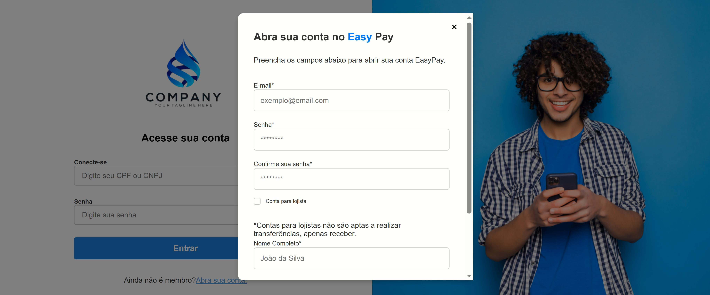

# 💸 EasyPay

Projeto pessoal desenvolvido com foco em aprendizado e prática de tecnologias modernas do ecossistema **React** e simulação de back-end com **JSON Server**. O EasyPay é uma aplicação bancária fictícia onde é possível realizar transferências, visualizar transações e informações da conta.

---

## 📸 Preview

### Login


### Cadastro de Conta


### Tela Principal com Transações


---

## 🚀 Tecnologias Utilizadas

- **React**
- **Vite**
- **Styled-components**
- **Zod + React Hook Form** (validação de formulários)
- **JSON Server** (simulando um backend REST)
- **Axios** (requisições HTTP)
- **React Router DOM** (navegação SPA)
- **JavaScript (ES6+)**

---

## 📦 Funcionalidades

- [x] Login com validação de CPF/CNPJ e senha
- [x] Criação de conta via modal
- [x] Transferência de valores com etapas (Conta → Valor → Revisão)
- [x] Validações robustas usando **Zod**
- [x] Feedback visual com **modais de sucesso e erro**
- [x] Exibição das **últimas transações**
- [x] Layout responsivo e acessível

---

## ✨ Em Andamento

- [ ] Substituir JSON Server por back-end real (TypeScript ou Java)
- [ ] Implementar autenticação com JWT
- [ ] Refatorar lógica de transações para maior consistência
- [ ] Melhorar acessibilidade e UI/UX

---

## 🖼️ Layout

### Login


### Home / Transações


> *As imagens são meramente ilustrativas — substitua pelos prints reais do seu projeto.*

---

## 🛠️ Como rodar localmente

```bash
# Clone o repositório
git clone https://github.com/seu-usuario/EasyPay.git

# Acesse a pasta
cd EasyPay

# Instale as dependências
npm install

# Inicie o JSON Server
npx json-server --watch api/db.json --port 5000

# Em outro terminal, rode o projeto React
npm run dev


O aplicativo estará disponível em: http://localhost:5173

📚 Aprendizados
Esse projeto surgiu com o objetivo de consolidar meus conhecimentos em:

Criação de SPAs com React

Estilização moderna com Styled-components

Validação de formulários com Zod

Comunicação com APIs REST simuladas

Organização de código e componenteização

Estruturação de um projeto escalável

🧑‍💻 Autor
Pedro César